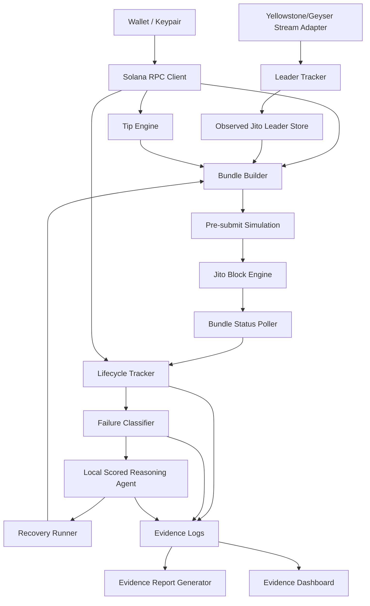

# Solana Tx Sentinel Architecture Design

## Executive Summary

Solana Tx Sentinel is an AI-assisted transaction reliability stack for Solana Jito bundle submission. It monitors live Yellowstone/Geyser slot streams, detects leader timing, calculates dynamic tips, constructs Jito bundles, tracks transaction lifecycle stages, classifies failures, and uses a scored local reasoning agent for recovery decisions. The project is built to produce auditable evidence rather than claim landing or recovery outcomes that were not observed.

## System Goals

- Submit Jito bundles through a Jito-only path.
- Monitor live slot and leader data.
- Calculate dynamic tips from recent fee conditions and Jito tip accounts.
- Track submitted, processed, confirmed, and finalized lifecycle stages.
- Detect and classify failures.
- Demonstrate autonomous retry after expired blockhash.
- Produce auditable evidence logs.

## High-Level Architecture Diagram



## Component Responsibilities

- Wallet / Keypair Loader: loads the configured signer for testnet/devnet/mainnet runs without embedding secrets in generated reports.
- Solana RPC Client: fetches blockhashes, recent prioritization fees, signature statuses, and leader schedule data.
- Yellowstone/Geyser Stream Adapter: captures live slot updates from Yellowstone/Geyser; the submitted stream evidence uses `grpcurl` against `geyser.Geyser/Subscribe`.
- Leader Tracker: resolves leaders for observed slots and feeds timing decisions.
- Observed Jito Leader Learner: learns leaders from landed bundle evidence and stores observed landed leader identities.
- Tip Engine: uses recent prioritization fee samples, urgency settings, and configured bounds to calculate a Jito tip.
- Bundle Builder: constructs combined-tip or separate-tip bundle layouts, including compute budget and tip instructions.
- Pre-submit Simulation: simulates signed transactions before Jito submission and records logs, errors, and units consumed when available.
- Jito RPC Client: talks to the Jito Block Engine for tip accounts, `sendBundle`, inflight statuses, and final bundle statuses.
- Bundle Status Poller: polls inflight and final bundle status until landed, failed, invalid after timeout, or timeout.
- Lifecycle Tracker: tracks submitted, processed, confirmed, and finalized commitment stages for submitted signatures.
- Failure Classifier: classifies expired blockhash, compute exceeded, bundle failures, invalid tip account, and fee-pressure-ready failure types.
- Local Scored Reasoning Agent: scores candidate recovery actions and returns a structured operational decision.
- Recovery Runner: follows the selected agent action and performs blockhash refresh/resubmit only when the decision allows it.
- Evidence Report Generator: creates a markdown evidence report from JSON and JSONL evidence logs.
- Evidence Dashboard Generator: creates a static HTML dashboard for quick local inspection of final evidence.

## Data Flow

Live stream flow: Yellowstone/Geyser emits slot updates through `geyser.Geyser/Subscribe`; the grpcurl adapter normalizes updates, resolves leaders where possible, and writes stream evidence under `data/stream`.

Bundle submission flow: the system loads the wallet, fetches fee and tip account data, calculates a tip, builds a signed bundle transaction, simulates it, and submits through Jito `sendBundle` only.

Lifecycle tracking flow: after submission, bundle status is polled through Jito and the transaction signature is tracked through Solana commitment stages. The evidence logs keep bundle status and signature lifecycle separate.

Failure recovery flow: controlled failures are classified, passed to the local scored reasoning agent, and recovery runners follow the selected action. For expired blockhash, the expected action is to refresh the blockhash, recalculate tip, and resubmit.

Evidence reporting flow: JSONL logs are aggregated into markdown reports, a compliance audit, and a static dashboard. These outputs point back to raw evidence files.

## Jito Bundle Flow

1. Fetch recent prioritization fee data.
2. Fetch current Jito tip accounts.
3. Calculate dynamic tip using recent fee conditions, urgency multiplier, and configured min/max bounds.
4. Build transaction with compute budget and Jito tip instruction.
5. Simulate signed transactions before submission.
6. Submit through Jito `sendBundle`; do not use normal RPC rebroadcast for the Jito bundle path.
7. Poll inflight and final bundle status.
8. Track signature commitment stages.
9. Persist bundle, lifecycle, simulation, and status evidence.

## Yellowstone/Geyser Streaming Flow

The live stream evidence uses the Solinfra Yellowstone/Geyser endpoint and the `geyser.Geyser/Subscribe` method. The project includes a native `@triton-one/yellowstone-grpc` adapter, but native Node subscribe was unstable in testing, so the final live Yellowstone evidence was captured through `grpcurl`.

The stream adapter captures slot updates from the live stream, normalizes them, resolves leaders where possible, and writes evidence to `data/stream`. `solana_ws` remains available as a fallback/local testing mode, but it is not used to claim Yellowstone evidence.

Actual stream evidence:

- source: `yellowstone`
- transport: `grpcurl`
- captured_count: `25`
- first_slot: `426728541`
- last_slot: `426728565`
- unique_leader_count: `6`

## AI Agent Responsibility

Category: Failure Reasoning / Autonomous Retry.

The agent receives classified failure context and scores candidate recovery actions:

- `refresh_blockhash_and_retry`
- `increase_tip_and_retry`
- `wait_for_better_leader`
- `do_not_retry`
- `abort`

The recovery runner follows the selected action. If the agent returns `resubmit=false`, the runner does not resubmit. Decisions are written to `data/lifecycle/agent-decisions.jsonl`.

## Failure Handling Strategy

- `expired_blockhash`: refresh blockhash, recalculate tip, and retry when the scored policy selects retry.
- `compute_exceeded`: classify simulation or bundle failure logs that show compute budget exhaustion.
- `bundle_failure`: classify bundle-level failures that are not normal signature lifecycle failures.
- `invalid_tip_account`: classify Jito rejection when the selected tip recipient is not in the current Jito tip account set.
- `fee_too_low`: classifier-ready category for fee pressure or under-tipped submission evidence.

Before retry, the system refreshes blockhash and recalculates tip when the selected agent decision requires it.

## Lifecycle and Commitment Tracking

Lifecycle evidence records:

- `submitted_at`
- `processed_at`
- `confirmed_at`
- `finalized_at`
- processed, confirmed, and finalized slot numbers
- submitted-to-processed, processed-to-confirmed, confirmed-to-finalized, and submitted-to-finalized latency deltas

The `processed_at` to `confirmed_at` delta matters because it shows propagation and confirmation latency after the transaction is first processed. Finalized blockhashes should not be used for time-sensitive transactions because finalized commitment lags and can reduce usable blockhash lifetime.

## Evidence Summary

Final evidence session:

- evidence_session_id: `297d1dc7-dc1d-44dd-9bc2-f0aed3d26cd3`
- requested_count: `10`
- completed_count: `10`
- bundle_landed_count: `10`
- signature_finalized_count: `10`
- bundle_failed_count: `0`
- bundle_invalid_count: `0`
- code_inconsistent_count: `0`
- average_submitted_to_processed_ms: `7011`
- average_submitted_to_confirmed_ms: `7237`
- average_submitted_to_finalized_ms: `15734`
- tip_lamports_min: `100000`
- tip_lamports_max: `100000`

Controlled failure evidence:

- `expired_blockhash_bundle`
- `compute_exceeded_bundle`
- `invalid_tip_account_bundle`

## Infrastructure Decisions

- TypeScript / Node.js for scripts and typed evidence handling.
- JSONL evidence logs for append-only operational records.
- Jito testnet Block Engine for repeatable bundle evidence.
- Solinfra Yellowstone/Geyser for live stream evidence.
- grpcurl transport for live `Subscribe` evidence because native Node subscribe was unstable.
- No RPC rebroadcast in the Jito bundle path.
- Dashboard generated as static HTML with no backend.

## Known Limitations

- Final 10-bundle landed evidence was collected on Jito testnet, not mainnet.
- Mainnet smoke evidence was not forced because the wallet did not have enough SOL.
- Native Yellowstone client `getVersion` worked but subscribe was unstable, so grpcurl transport was used.
- Local scored reasoning agent is not an external LLM.
- No MEV/profitability claim is made.

## Reproduction Commands

```bash
pnpm install
pnpm check:rpc
pnpm check:jito
pnpm stream:capture
pnpm leaders:learn-jito
pnpm bundle:preview
pnpm bundle:send
pnpm evidence:bundles 10
pnpm bundle:fault-expired
pnpm bundle:fault-compute
pnpm bundle:fault-invalid-tip
pnpm agent:diagnose
pnpm demo:retry
pnpm report:evidence
pnpm report:compliance
pnpm report:dashboard
```

## Evidence Files

- `docs/evidence-report.md`
- `docs/competition-compliance.md`
- `docs/dashboard.html`
- `data/lifecycle/latest-evidence-summary.json`
- `data/lifecycle/jito-bundles.jsonl`
- `data/lifecycle/jito-bundle-failures.jsonl`
- `data/lifecycle/agent-decisions.jsonl`
- `data/lifecycle/autonomous-recovery.jsonl`
- `data/lifecycle/observed-jito-leaders.json`
- `data/stream/latest-stream-evidence-summary.json`
- `data/stream/slot-stream-evidence.jsonl`
